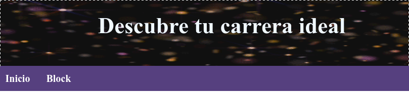
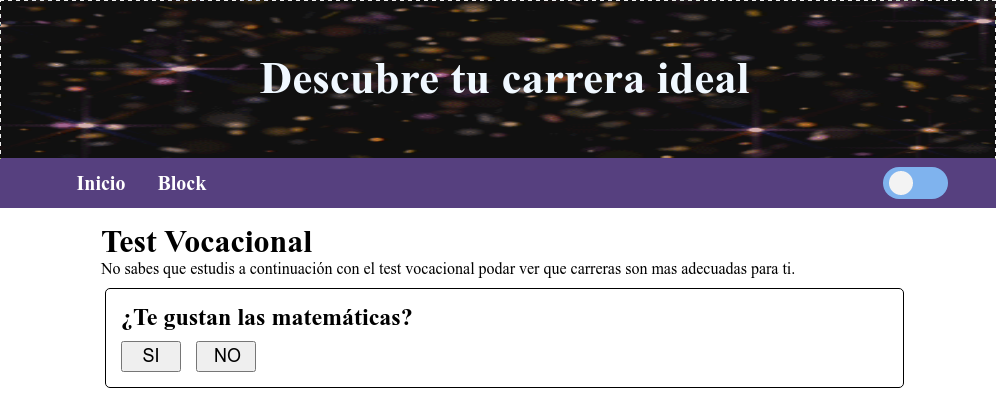

# Test Vocacional

En este blog, te llevar&#233; a trav&#233;s del emocionante proceso de desarrollo de un test vocacional en una p&#225;gina web, utilizando los lenguajes de programaci&#243;n HTML, CSS y JavaScript. A lo largo de las versiones, ver&#225;s cómo se han introducido y modificado varios elementos en la p&#225;gina para mejorar la experiencia del usuario.

## Verción 1.0
En la versión 1.0, dimos nuestros primeros pasos en la creación del test vocacional. Aquí están los cambios notables:

- Agregamos un atractivo gif como imagen hero.
- Iniciamos el diseño del menú de navegación (aún en proceso).



## Verci&#243;n 1.1
En la versión 1.1, hicimos algunos ajustes para mejorar la presentación y usabilidad:

- Estilizamos el formato de las preguntas para una apariencia más atractiva.
- Introdujimos un botón para habilitar el modo oscuro.



## Verci&#243;n 1.2
En la versión 1.2, continuamos mejorando la experiencia del usuario:

- Ahora mostramos las preguntas a través de un arreglo, simplificando la administración de contenido.
- Estamos en proceso de estilizar los botones de "Siguiente" y "Anterior" para una navegación más fluida.
- Estamos trabajando en la incorporación de un nuevo botón para guardar tus respuestas.

Además, aquí tienes una vista previa del código que utilizamos para mostrar las preguntas en la pantalla:

```javascript
function PreguntasPantalla(){
    let i;
    let texto = document.querySelectorAll(".txt");
    
    for(i = 0; i <= preguntas.length; i++){
        texto[i].innerHTML = preguntas[i];
        //console.log(`Pregunta: ${preguntas[i]}`);
    }
}
PreguntasPantalla();
```

# Verci&#243;n 2.0
En la versión 2.0, hemos dado un gran paso en la evolución del test vocacional:

- Introdujimos un carrusel para mostrar las preguntas en bloques de 10, mejorando la navegación. 
- Implementamos funcionalidad a los botones de "Siguiente" y "Anterior" para facilitar la exploración de las preguntas.

# Verci&#243;n 2.1
En la versión 2.1, continuamos optimizando la experiencia del usuario:

- Actualizamos el código para generar documentos, lo que permitirá guardar tus resultados.
- El menú de navegación está ahora completamente funcional.
- También hemos habilitado el botón para guardar tus respuestas.

# Vercion 2.2
En la última versión, la 2.2, hemos alcanzado un hito importante:

- El botón para guardar el contenido de las preguntas ahora está completamente funcional, lo que te permitirá guardar tus resultados de manera sencilla.

¡Mantente atento para futuras actualizaciones y mejoras en nuestro test vocacional! Estamos comprometidos a brindarte la mejor experiencia posible en tu búsqueda de la carrera ideal.